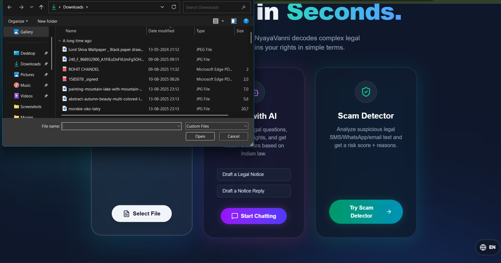
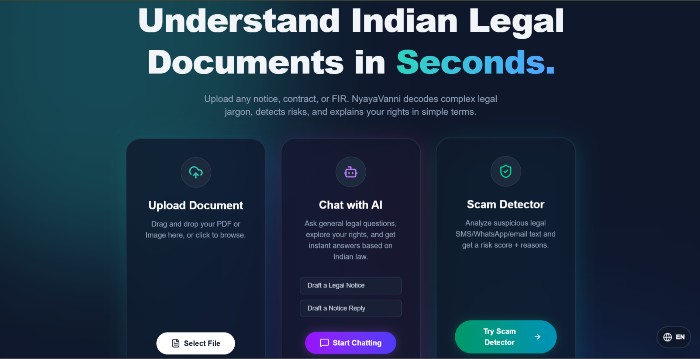
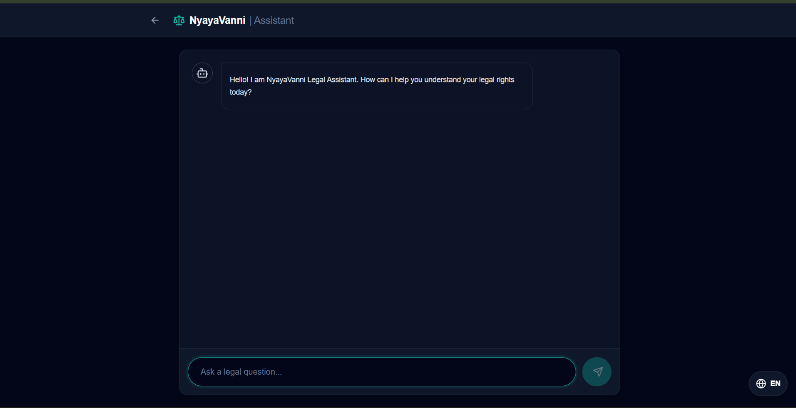
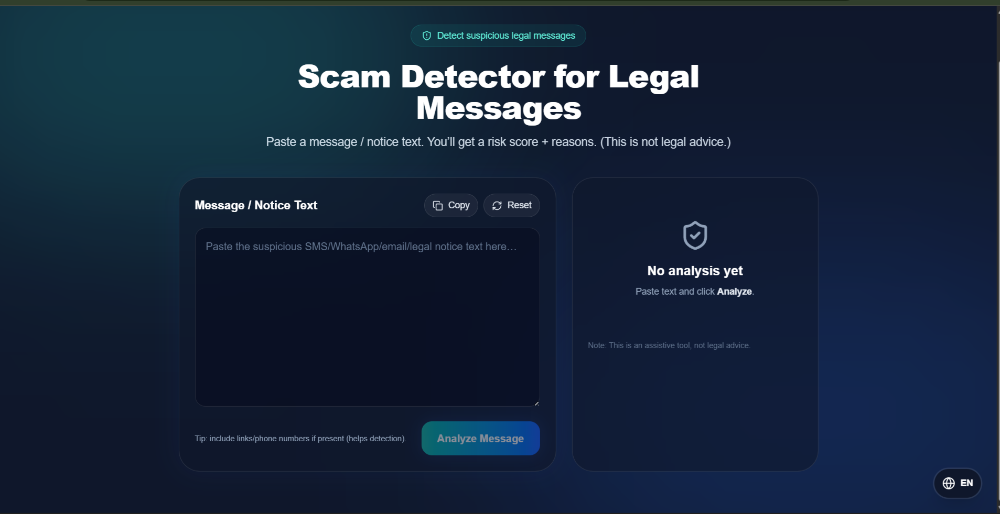

# NyayaVanni ⚖️  
### AI-Powered Legal Document Intelligence Platform

<p align="center">
  
  
  
  
  
</p>

<p align="center">
  <b>Understand complex legal documents in seconds using AI.</b>
  <br/>
  Upload contracts, notices, agreements, or scanned legal files and receive intelligent legal insights, OCR-powered extraction, clause analysis, and AI-generated explanations.
</p>

---

# 📑 Table of Contents

- [✨ Features](#-features)
- [🖼️ Screenshots](#️-screenshots)
- [🛠️ Tech Stack](#️-tech-stack)
- [📂 Project Structure](#-project-structure)
- [⚙️ Installation & Setup](#️-installation--setup)
- [🧪 Frontend Validation](#-frontend-validation)
- [🔑 Environment Variables](#-environment-variables)
- [📡 API Endpoints](#-api-endpoints)
- [🔍 OCR Workflow](#-ocr-workflow)
- [⚠️ OCR Failure Protection](#️-ocr-failure-protection)
- [🤝 Contributing](#-contributing)
- [🔒 Security & Disclaimer](#-security--disclaimer)
- [🗺️ Future Roadmap](#️-future-roadmap)
- [🐛 Troubleshooting](#-troubleshooting)
- [📄 License](#-license)

---

# ✨ Features

## 📄 AI Legal Document Analysis

NyayaVanni intelligently analyzes legal documents and provides:

- Document type detection
- Key party identification
- Important dates extraction
- Simplified legal summaries
- Legal clause understanding

### 📑 Supported Document Types

- Agreements
- Contracts
- Legal notices
- Consumer complaints
- Financial/legal documents
- Scanned PDFs and images

---

## ⚖️ AI Risk Assessment

Automatically identifies:

- High-risk clauses
- Legal obligations
- Financial liabilities
- Penalty conditions
- Potential legal consequences

### ✅ Provides

- Risk severity analysis
- Recommended actions
- Easy-to-understand explanations

---

## 💬 Smart AI Legal Chat

Chat directly with uploaded legal documents.

### Example Questions

- “What are my risks in this contract?”
- “What is the termination clause?”
- “Who is liable for damages?”
- “Summarize this document.”

### ⚡ Powered By

- Gemini AI
- Context-aware legal retrieval
- RAG-based querying

---

## 🔍 OCR Support

Supports OCR for:

- Scanned PDFs
- Images
- Low-quality legal scans
- Handwritten-friendly preprocessing

### 📂 Supported Formats

- PDF
- PNG
- JPG
- JPEG

---

## 🧠 Intelligent Clause Extraction

Extracts:

- Payment clauses
- Liability clauses
- Arbitration clauses
- Termination clauses
- Legal obligations
- Penalty sections

---

## 🌙 Modern UI/UX

- Responsive design
- Clean dashboard
- Dark/Light mode support
- Beginner-friendly interface
- Fast document uploads

---

# 🖼️ Screenshots

## 📤 Document Upload Interface

<p align="center">
  
</p>

---

## 📊 AI Legal Analysis Dashboard

<p align="center">
  
</p>

---

## 💬 AI Legal Chat Assistant

<p align="center">
  
</p>

---

## ⚠️ Risk Assessment UI

<p align="center">
  
</p>

---

# 🛠️ Tech Stack

## 🔹 Backend

| Technology | Purpose |
|---|---|
| FastAPI | Backend framework |
| Gemini AI | AI-powered legal analysis |
| FAISS | Vector similarity search |
| PyMuPDF | PDF text extraction |
| Tesseract OCR | OCR engine |
| Pillow | Image preprocessing |
| Python | Core backend language |

---

## 🔹 Frontend

| Technology | Purpose |
|---|---|
| React 19 | Frontend framework |
| Vite | Build tool |
| Tailwind CSS | Styling |
| Axios | API requests |
| Lucide React | Icons |

---

# 📂 Project Structure

```text
NyayaVanni/
│
├── .github/
│
├── backend/
│   ├── api/
│   ├── data/
│   ├── models/
│   ├── services/
│   └── uploads/
│
├── frontend/
│   ├── public/
│   └── src/
│
├── designs/
├── screenshots/
├── tests/
│
├── CODE_OF_CONDUCT.md
├── CONTRIBUTING.md
├── LICENSE
├── SECURITY.md
├── main.py
└── README.md
```

---

# ⚙️ Installation & Setup

# 🖥️ Prerequisites

Before running the project install:

- Python 3.10+
- Node.js 18+
- Git
- Tesseract OCR

---

# 🔧 Backend Setup

## 1️⃣ Clone Repository

```bash
git clone https://github.com/your-username/NyayaVanni.git
cd NyayaVanni
```

---

## 2️⃣ Navigate to Backend

```bash
cd backend
```

---

## 3️⃣ Create Virtual Environment

### Windows

```bash
python -m venv venv
venv\Scripts\activate
```

### Linux/Mac

```bash
python3 -m venv venv
source venv/bin/activate
```

---

## 4️⃣ Install Dependencies

```bash
pip install -r requirements.txt
```

---

## 5️⃣ Configure Environment Variables

Create `.env`

```env
GEMINI_API_KEY=your_gemini_api_key
```

---

## 6️⃣ Run Backend Server

```bash
uvicorn main:app --reload
```

Backend runs at:

```text
http://127.0.0.1:8000
```

---

# 💻 Frontend Setup

## 1️⃣ Navigate to Frontend

```bash
cd frontend
```

---

## 2️⃣ Install Dependencies

```bash
npm install
```

---

## 3️⃣ Configure Frontend Environment

Create `.env`

```env
VITE_API_URL=http://127.0.0.1:8000
```

---

## 4️⃣ Run Frontend

```bash
npm run dev
```

Frontend runs at:

```text
http://localhost:5173
```

---

# 🧪 Frontend Validation

Run these commands from the `frontend/` directory before submitting UI changes.

## 1️⃣ Install dependencies

```bash
npm install
```

## 2️⃣ Check code quality

```bash
npm run lint
```

## 3️⃣ Verify the production build

```bash
npm run build
```

## 4️⃣ Preview the built UI locally

```bash
npm run preview
```

Open the preview URL shown in the terminal and manually verify the touched UI flow.

## Current UI test status

The frontend currently does not define a dedicated unit or integration test script in `frontend/package.json`. Until a test runner is added, use `npm run lint`, `npm run build`, and a local preview smoke check as the required frontend validation path.

When a test runner is introduced, add the command to `frontend/package.json` and document it here, for example:

```bash
npm run test
```

---

# 🔑 Environment Variables

## Backend `.env`

```env
GEMINI_API_KEY=your_api_key
```

---

## Frontend `.env`

```env
VITE_API_URL=http://localhost:8000
```

---

# 📡 API Endpoints

| Method | Endpoint | Description |
|---|---|---|
| POST | `/api/upload` | Upload legal document |
| POST | `/api/analyze/{id}` | Analyze uploaded document |
| POST | `/api/chat` | Chat with uploaded document |
| GET | `/health` | Health check |

---

# 🔍 OCR Workflow

```text
Document Upload
       ↓
PDF/Image Processing
       ↓
OCR/Text Extraction
       ↓
Text Validation
       ↓
AI Legal Analysis
       ↓
Risk Assessment & Clause Extraction
```

---

# ⚠️ OCR Failure Protection

NyayaVanni prevents AI hallucinations when OCR extraction fails.

## ✅ Validation Added

The backend now checks:

- Empty OCR output
- Extremely low text extraction
- Unreadable or corrupted documents
- Failed parsing attempts

If OCR fails:

- AI legal analysis is stopped
- Fake legal sections are NOT generated
- Users receive a clean fallback message

### Example Response

```json
{
  "status": "ocr_failed",
  "message": "Unable to extract readable text from the document."
}
```

---

# 🤝 Contributing

We welcome contributions from developers and open-source enthusiasts.

## 📌 Contribution Steps

### 1️⃣ Fork the repository

### 2️⃣ Create a new branch

```bash
git checkout -b fix/your-feature-name
```

### 3️⃣ Make your changes

### 4️⃣ Commit changes

```bash
git commit -m "fix: improve OCR validation flow"
```

### 5️⃣ Push branch

```bash
git push origin fix/your-feature-name
```

### 6️⃣ Open a Pull Request

---

# 🧹 Commit Message Convention

| Type | Example |
|---|---|
| feat | feat: add OCR confidence validation |
| fix | fix: prevent fake legal analysis |
| docs | docs: improve README formatting |
| style | style: improve dashboard UI |

---

# 🔒 Security & Disclaimer

## 🔐 Privacy Notice

- Uploaded documents are processed securely
- Sensitive legal information should be handled carefully
- Avoid uploading confidential government/legal records publicly

---

## ⚠️ AI Disclaimer

NyayaVanni provides AI-generated legal assistance for educational and informational purposes only.

It does NOT replace:

- Professional legal consultation
- Certified legal advice
- Court-approved legal interpretation

Always consult a qualified legal professional for official legal decisions.

---

# 🗺️ Future Roadmap

## 🚀 Planned Features

- Multi-language legal support
- Voice-based legal assistant
- PDF annotation support
- Case law recommendation engine
- Cloud document storage
- Advanced legal summarization
- AI-powered compliance checker
- Mobile application support

---

# 🐛 Troubleshooting

## ❌ GEMINI_API_KEY Missing

Make sure your backend `.env` contains:

```env
GEMINI_API_KEY=your_api_key
```

---

## ❌ Uvicorn Not Recognized

Activate virtual environment first.

### Windows

```bash
venv\Scripts\activate
```

Then run:

```bash
uvicorn main:app --reload
```

---

## ❌ OCR Not Working

Install Tesseract OCR.

### Windows Download

https://github.com/UB-Mannheim/tesseract/wiki

After installation, add Tesseract to system PATH.

---

## ❌ Frontend Cannot Connect to Backend

Check frontend `.env`

```env
VITE_API_URL=http://127.0.0.1:8000
```

---

# 🌟 Open Source Programs

Proudly contributing to:

- GirlScript Summer of Code (GSSoC)
- Open-source legal AI innovation

---

# 👨‍💻 Contributors

Thanks to all contributors helping improve NyayaVanni.

```html
<a href="https://github.com/your-username/NyayaVanni/graphs/contributors">
  
</a>
```

---

# 📄 License

This project is licensed under the MIT License.

See the [LICENSE](LICENSE) file for more information.

---

# ⭐ Support the Project

If you found this project useful:

- ⭐ Star the repository
- 🍴 Fork the project
- 🐛 Report issues
- 🚀 Contribute improvements

---

<p align="center">
  Built with ❤️ using FastAPI, React, Gemini AI, and OCR Intelligence
</p>
